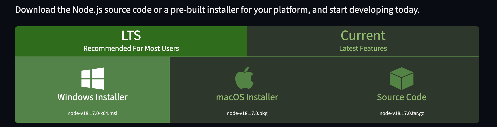

# Гайд по запуску скрипта
**Скчиваем папку с программой нажав в репозитории Code -> Download Zip** 
**Для начала нужно установить nodejs  ->  [https://nodejs.org/en/download](https://nodejs.org/en/download)** 

На сайте выбираем либо Windows installer либо macOS Installer

На Linux пишем команду в терминале → sudo apt install nodejs

Теперь распаковываем архив с программой и переносим папку из архива в удобное для вас место, например на рабочий стол

После чего архив можно удалить

**Теперь нужно создать аптос кошельки, и пополнить их ( рекомендуется от 0.4 аптоса, чем больше баланс тем разнообразней будут действия с NFT )**

Создать кошельки можно по классике через  [https://cointool.app/createWallet/aptos](https://cointool.app/createWallet/aptos)

В поле вводим желаемое количество кошельков

Потом выключаем интернет и нажимаем на синюю стрелочку, после генерации жмем export чтобы скачать кошельки в виде таблички

Соxраняем то что скачали в надежном месте. 
Открываем скачанный файл и копируем приватные ключи

Переходим в папку с программой и открываем файл privateKeys.txt
Вставляем туда скопированные приватники

Теперь нужно пополнить все наши кошельки ( рекомендуется от 0.4 аптоса, чем больше баланс тем разнообразней будут действия с NFT ) 
Сделать это можно с любой популярной биржи: Binance, Bybit, OKX

После пополнения кошельков нужно настроить конфиг
В папке программы открываем config.json (можно просто через блокнот)

тут нужно настроить некоторые значения по своему усмотрению (либо оставить все по умолчанию):

**txAmountMin** - минимальное желаемое количество транзакций на каждом кошельке за сессию

**txAmountMax** - максимальное желаемое количество транзакций на каждом кошельке за сессию
Например если вы указали txAmountMin = 2 и txAmountMax = 4, то на каждом кошельке будет выполнено рандомное количество транзакций от 2 до 4

**timeSleepMin** - минимальная задержка между каждой транзакцией в миллисекундах 
**timeSleepMax** - максимальная задержка между каждой транзакцией миллисекундах

Для перевода минут в миллисекунды умножайте количество минут на 60 000

Например если вы указали timeSleepMin = 120000 и timeSleepMax = 300000, то на каждом задержка между каждой транзакцией будет рандомно выбираться в диапазоне от 2 до 5 минут

**nodeURL** - тут можете поменять ноду на которую будут отправляться транзакции. Список нод можно найти на [https://cointool.app/rpcServer/aptos](https://cointool.app/rpcServer/aptos)

**APTprice -** здесь рекомендуется поставить актуальную цену аптоса (хотя бы примерно)

После настройки убедитесь что вы случайно не удалили запятые, кавычки и прочие присущие json’у символы (сравнить можно со скрином выше), а так же что вы указали дробные числа через **точку** а не через запятую. В противном случае программа может сломаться

Теперь, когда **config.json настроен можно запускать скрипт**

**Для windows:**

открываем папку программы и запускаем файл run_on_windows.bat

если вылезает это окно то жмем more info

И потом **Run anyway**

**Для macOS/Linux:**

открываем папку в терминале и пишем команду **make run**

Если все сделали правильно, после запуска вы должны увидеть окно консоли с запущеной программой:

Если табличка в консоли выглядит криво то попробуйте растянуть окно консоли

Спустя некоторое время вы увидите что начинают идти транзакции на кошельках:

Давайте подробнее разберем что там написано:

**index -** порядковый номер вашего кошелька из файла privateKeys.txt

**session_duration_min -** Длительность сессии для каждого кошелька в минутах

**progress -** сколько транзакций проделано из общего количества для конкретного кошелька

**current_tx_type -** текущий тип транзакции (действие с NFT/ торговля на DEX/ действие с ликвидным стейкингом)

**last_tx_result -** результат выполнения последней транзакции

Может быть трех видов:

1) TX was successful - все ок
2) Error when creating a TX  - такое бывает если например выпало действие с нфт, но коллекция для покупки не нашлась
3) TX failed - такое бывает крайне редко, например когда за время формирования и отправки транзакции выбранную нфт кто то купил

**min_until_next_tx -** Показывает сколько минут ожидания до следующей транзакции на кошельке

**status -** если 0 то кошелек еще не завершил сессию, если 1 то завершил

После того как все кошельки завершат сессию программа автоматически завершится (это будет видно в консоли, там будет press any key to continue )

Если остались какие то вопросы или есть сложности с запуском скрипта пишите мне в тг - @tyrandel_0

**Удачного абуза)!**
